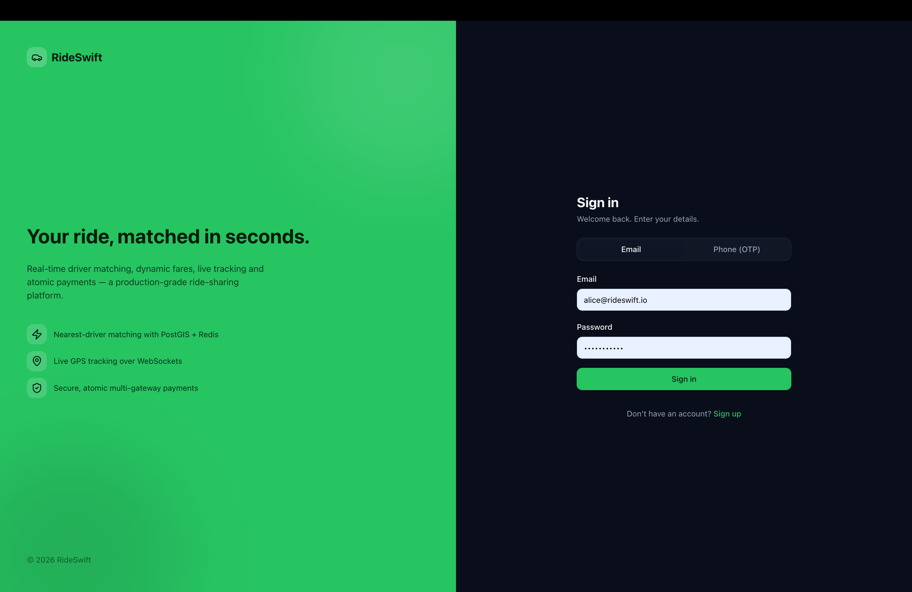
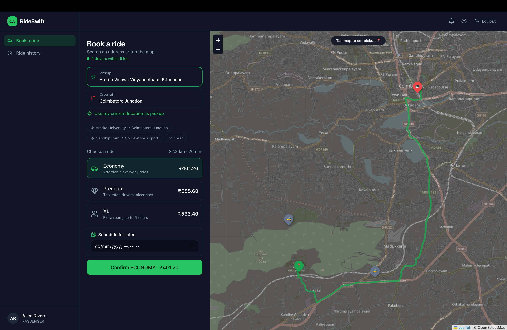
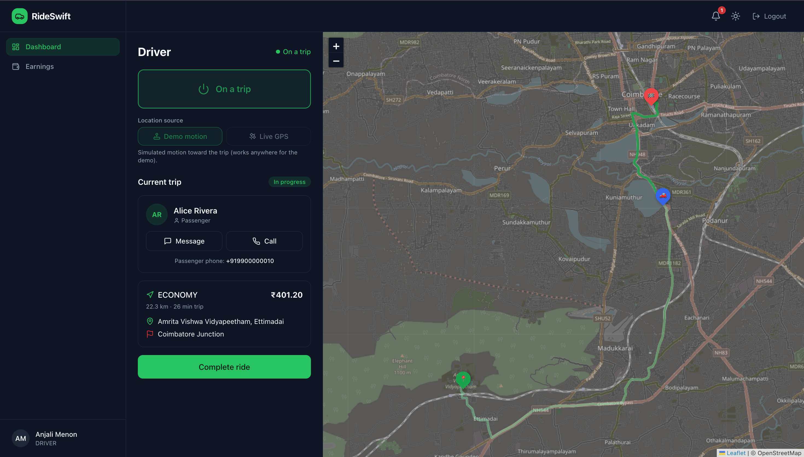
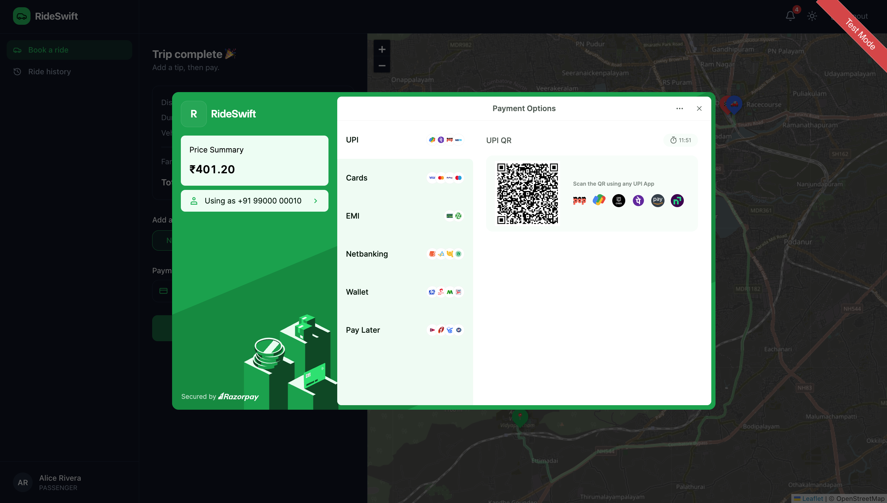
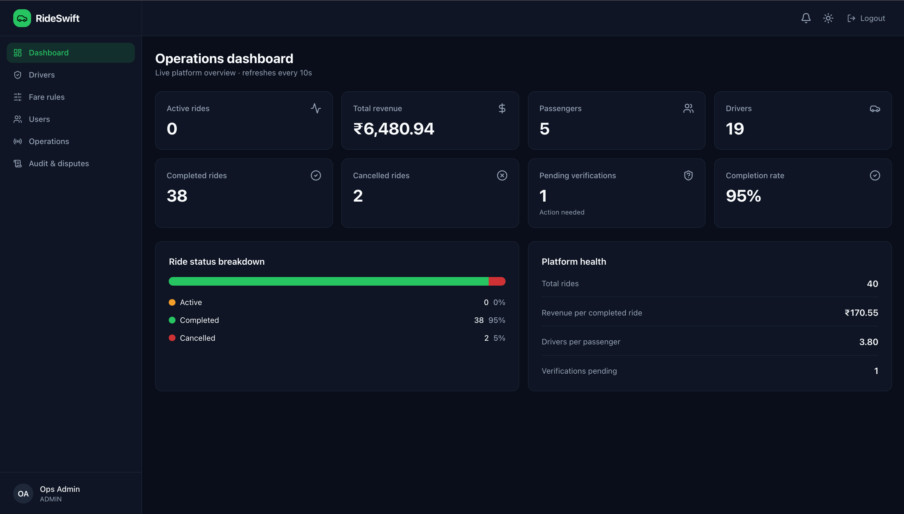

# RideSwift

An Uber-style ride-hailing app I built end to end — a Spring Boot API, a React + TypeScript
frontend, Postgres/PostGIS for the map/geo work, and Redis for driver matching. Trips are
tracked live over WebSockets. Everything runs around Coimbatore, and there's a small fleet of
simulated drivers so you can watch a whole ride happen (book → match → drive → pay) without
needing a second phone.

## Screenshots

**Login** — email/password or phone OTP.



**Book a ride** — search an address or tap the map. Nearby cars show up live ("1 driver within
5 km"), you get the real road route and ETA, and a price for each ride type in ₹.



**On the trip** — once a driver accepts you see their car, name, rating and vehicle, and the car
moves along the route in real time as they drive you from Ettimadai to Coimbatore Junction.



**Pay** — at the end the fare opens in a real Razorpay checkout (test mode) — UPI, cards, QR,
netbanking, the lot.



**Admin dashboard** — a live operations view: revenue, ride counts, completion rate, driver
verification queue and platform health, all refreshing every few seconds.



## Run it locally

```bash
docker compose up --build
```

This starts Postgres+PostGIS, Redis, the API and the web client. Open http://localhost:5173
(API docs at http://localhost:8080/swagger-ui.html). On first boot it seeds a demo dataset —
drivers spread around Coimbatore and Ettimadai, plus some past rides.

## Demo accounts

Every account uses the password **`password123`**.

**Admin**

| Email | Name |
|---|---|
| `admin@rideswift.io` | Ops Admin |

**Passengers**

| Email | Name |
|---|---|
| `alice@rideswift.io` | Alice Rivera |
| `bob@rideswift.io` | Bob Chen |
| `carol@rideswift.io` | Carol Diaz |
| `dave@rideswift.io` | Dave Patel |
| `eve@rideswift.io` | Eve Novak |

**Drivers — around Coimbatore**

| Email | Name |
|---|---|
| `mike@rideswift.io` | Mike Johnson |
| `driver2@rideswift.io` | Sara Lee |
| `driver3@rideswift.io` | Omar Haddad |
| `driver4@rideswift.io` | Nina Volkov |
| `driver5@rideswift.io` | Liam Murphy |
| `driver6@rideswift.io` | Priya Singh |
| `driver7@rideswift.io` | Tom Becker |
| `driver8@rideswift.io` | Yuki Tanaka |
| `driver9@rideswift.io` | Diego Costa |
| `driver10@rideswift.io` | Hana Kim |

**Drivers — around Ettimadai**

| Email | Name |
|---|---|
| `driver11@rideswift.io` | Karthik Raja |
| `driver12@rideswift.io` | Anjali Menon |
| `driver13@rideswift.io` | Suresh Kumar |
| `driver14@rideswift.io` | Deepa Nair |
| `driver15@rideswift.io` | Ravi Shankar |
| `driver16@rideswift.io` | Meena Iyer |
| `driver17@rideswift.io` | Arjun Pillai |
| `driver18@rideswift.io` | Lakshmi Devi |

`pending@rideswift.io` (Pat Pending) starts **unverified** — use it to try the admin approval
flow; an unverified driver can't go online until an admin verifies them.

## How it works

**Matching.** When you book, the backend looks for the nearest free, verified driver who has the
right type of car. It first checks a Redis geo-index of live driver positions (fast), and falls
back to a PostGIS spatial query against the database if the cache is cold. The closest match is
offered the ride.

**Why the ride gets accepted on its own.** A ride only moves forward when a *driver* acts —
accept, start, complete. In a real system that's a human tapping buttons in a driver app. For
the demo there's a server-side "fleet" of simulated drivers: the instant a booking is offered to
one of them, it **auto-accepts**, drives to your pickup along the real road route, starts the
trip using your PIN, and drops you off — so a ride you book completes by itself with nobody
sitting in the driver screen. If you'd rather drive it yourself, open a driver account in another
window and go online: that real driver takes priority and the simulator steps aside, so you get
the incoming-request popup and accept it manually. The fleet is controlled by the
`FLEET_ENABLED` flag.

**Live tracking.** The browser holds a STOMP-over-WebSocket connection. As the driver moves,
each position is pushed to the passenger's map, so the car animates along the route. The same
channel carries ride-status changes (matched → on the way → in progress → completed) and the
incoming-request popups on the driver side.

**Fares and surge.** A base fare strategy prices the ride from the real road distance and time.
On top of that, a surge decorator multiplies the price inside busy geographic zones based on a
live demand-to-supply ratio, so fares rise where lots of riders are competing for few drivers.

**Payments.** When a trip finishes, the passenger pays through a real Razorpay checkout (test
mode). The charge and any refund run in a single locked, all-or-nothing transaction, and every
change to a ride or payment is written to an audit trail you can inspect from the admin panel.

## Stack

**Backend** — Java 21, Spring Boot 3.3, Postgres 16 + PostGIS, Redis, Flyway, Spring Security
(JWT), Quartz, Resilience4j.

**Frontend** — React 18 + TypeScript, Vite, Zustand + React Query, Tailwind, Leaflet
(OpenStreetMap), SockJS/STOMP.

A few classic patterns show up where they fit: Strategy + Decorator for fare/surge, Factory for
the payment gateways, Observer for ride events, and a small state machine for ride status.

## Deploying

See [DEPLOY.md](DEPLOY.md). The included `render.yaml` deploys the whole stack to Render's free
tier in one shot — Postgres, Redis, the API and the static frontend.
